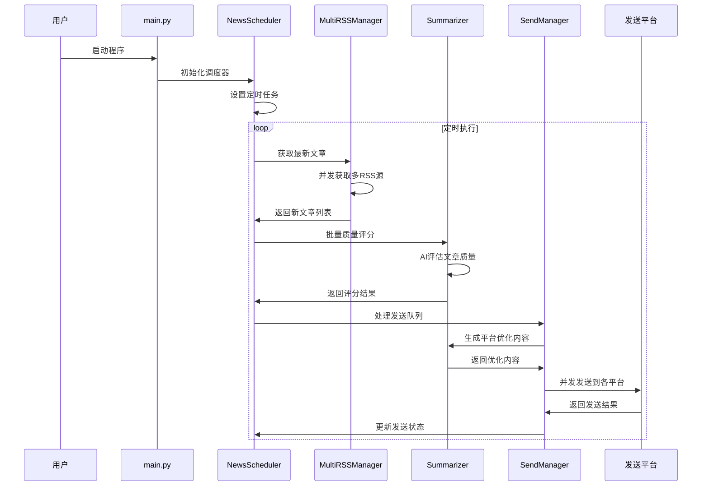
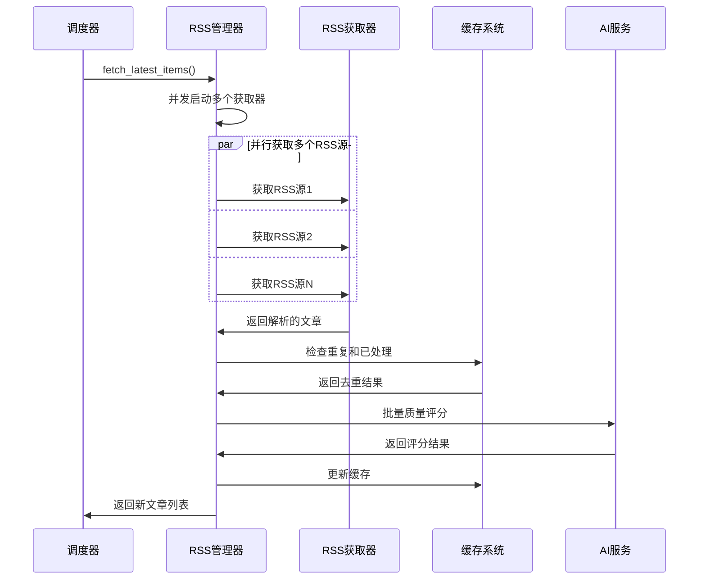
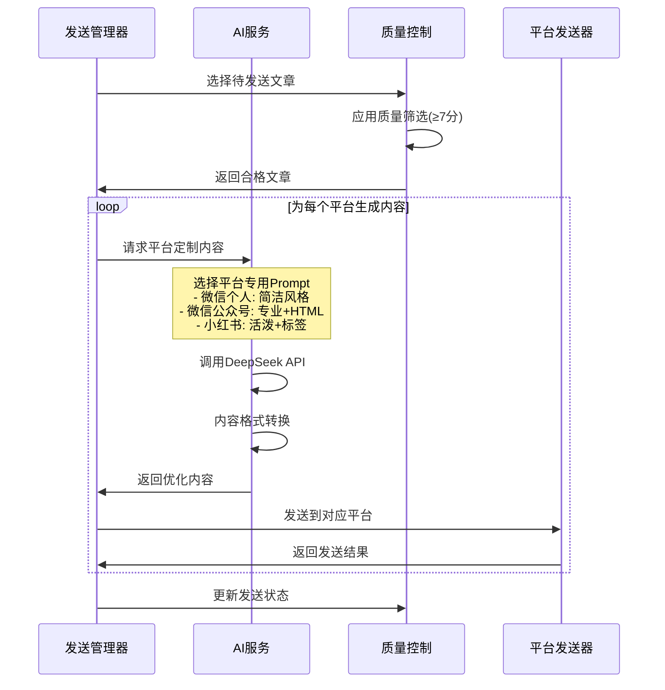
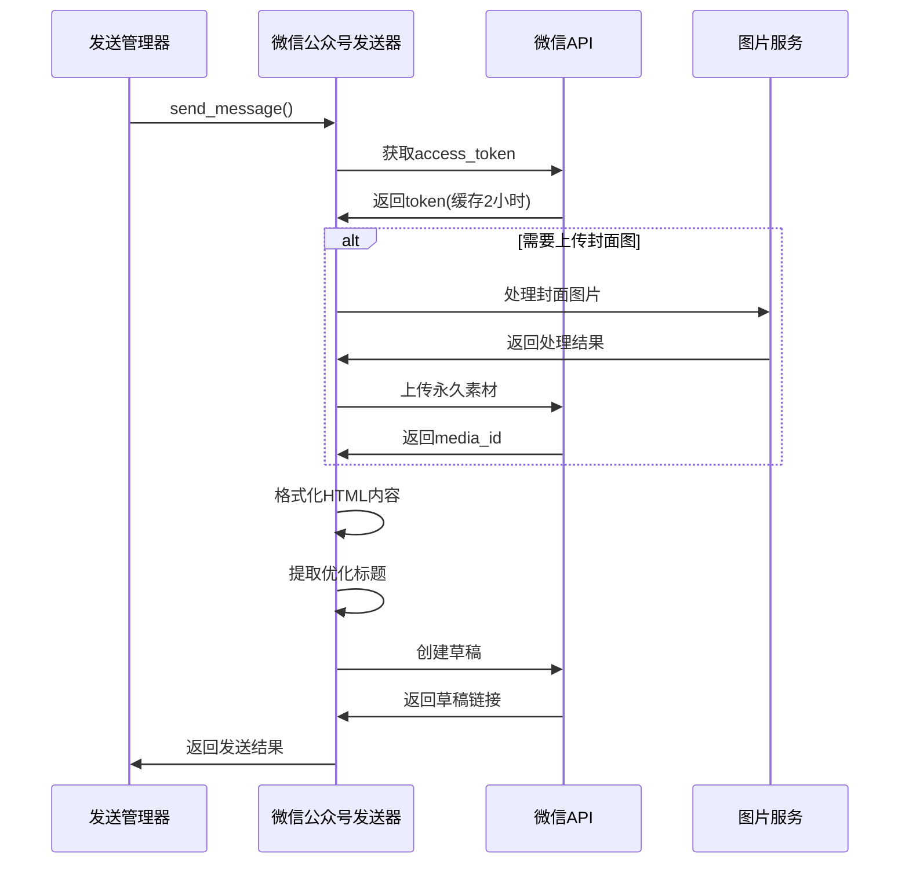
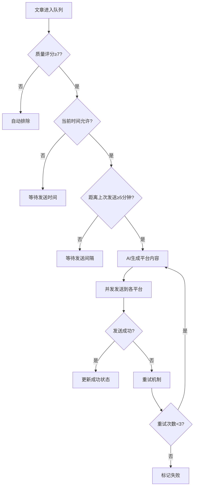

# CLAUDE.md - WeChat RSS Auto Sender 项目文档

## 📋 项目概述

**项目名称**: 微信RSS自动发送器 (WeChat RSS Auto Sender)  
**功能**: 自动获取RSS源文章，使用AI生成优化内容，并智能分发到多个平台  
**技术栈**: Python 3.11+, OpenAI API, WeChat API, RSS解析, HTML处理, 多线程调度  
**架构模式**: 微服务架构，模块化设计，支持多发送器扩展

## 🎯 核心特性

- 🔄 **智能RSS聚合**: 多源并发获取，去重过滤，时间范围控制
- 🤖 **AI内容优化**: DeepSeek API驱动，平台定制化内容生成
- 📊 **质量控制系统**: 智能评分(1-10分)，自动排除低质量内容
- 🎨 **多平台适配**: 微信个人号、微信公众号、小红书个性化内容
- ⏰ **智能调度**: 时间控制、发送间隔、随机延迟
- 🛡️ **容错机制**: 网络重试、错误恢复、状态持久化

## 📊 系统架构时序图

### 1. 整体系统运行流程



### 2. RSS获取和内容处理流程



### 3. AI内容生成和质量控制流程



### 4. 微信公众号发布流程



## 🏗️ 技术架构

### 核心模块结构

```
src/
├── main.py                    # 程序入口
├── core/                      # 核心功能
│   ├── config.py             # 配置管理 (环境变量+类属性)
│   ├── prompts.py            # AI提示词模板 (病毒式传播优化)
│   └── utils.py              # 工具函数 (日志、时间等)
├── services/                  # 业务服务层
│   ├── scheduler_service.py   # 任务调度器 (APScheduler)
│   ├── multi_rss_manager.py  # 多RSS源管理 (并发获取)
│   ├── rss_service.py        # RSS解析服务 (缓存+去重)
│   ├── ai_service.py         # AI服务 (内容生成+评分)
│   ├── send_service.py       # 发送管理 (质量控制+调度)
│   └── image_service.py      # 图片处理服务
├── integrations/             # 外部平台集成
│   ├── base_sender.py        # 发送器基类
│   ├── send_service_manager.py # 发送服务管理器
│   ├── wechat_client.py      # 微信个人号 (wxauto)
│   ├── wechat_official_sender.py # 微信公众号 (官方API)
│   └── xiaohongshu_sender.py # 小红书发送器
└── models/                   # 数据模型 (RSSItem等)
```

### 配置系统架构

```python
class Config:
    """统一配置管理 - 环境变量驱动"""
    
    # 🔄 RSS配置
    RSS_FEED_URLS = "techcrunch.com;theguardian.com;..."
    CHECK_INTERVAL_MINUTES = 30          # 检查间隔
    FETCH_ARTICLES_HOURS = 6             # 获取时间范围
    
    # 🤖 AI配置  
    OPENAI_API_KEY = "sk-xxx"
    OPENAI_BASE_URL = "https://api.deepseek.com/v1"
    OPENAI_MODEL = "deepseek-chat"
    
    # 📊 质量控制
    MIN_QUALITY_SCORE = 7                # 最低质量要求
    MAX_ARTICLES_PER_BATCH = 3           # 每批最大文章数
    
    # ⏰ 时间控制
    SEND_START_HOUR = 9                  # 发送开始时间
    SEND_END_HOUR = 21                   # 发送结束时间
    SEND_INTERVAL_MINUTES = 5            # 发送间隔
    
    # 🎯 平台配置
    WECHAT_CONTACT_NAME = "文件传输助手"
    WECHAT_OFFICIAL_APP_ID = "wxXXX"
    WECHAT_OFFICIAL_APP_SECRET = "xxx"
```

## 🤖 AI优化系统

### 增强的Prompt模板

我们实现了**病毒式传播**的内容生成策略：

```python
WECHAT_OFFICIAL_SINGLE_ARTICLE_SUMMARY = """
你是资深科技记者和内容策略师，专门创造高传播性的微信公众号内容。

🎯 核心使命: 创造无法抗拒的爆款内容

1. 📈 标题优化 - 心理触发机制:
   - 好奇缺口: "这个技术将颠覆整个行业，但99%的人还不知道"
   - 数据吸引: "3分钟看懂", "5大突破", "10倍提升"
   - 紧迫感: "最新突破", "重磅消息", "行业震动"
   - 痛点导向: "解决了困扰程序员10年的难题"

2. 🎪 内容结构 - 留存率优化:
   - 🎯 开篇钩子: 震撼统计/争议观点 (前50字符)
   - 📊 核心价值: 读者明确收益
   - 🔬 深度解析: 技术细节专业化
   - 💰 商业影响: 行业变革机会
   - 🚀 实践应用: 真实使用场景
   - 🎯 行动指南: 可执行下一步

3. 🧠 心理触发器:
   - 权威性: "硅谷巨头都在布局"
   - 稀缺性: "仅有少数公司掌握"
   - 社会证明: "业内权威分析"
   - FOMO: "错过这个趋势，你可能落后3年"

输出格式:
[TITLE] 病毒式中文标题
[CONTENT] HTML格式专业内容
[METADATA]
📊 热度评分: X.X
🎯 目标受众: 具体受众
🏷️ 文章标签: #标签1 #标签2 #标签3
"""
```

### 质量评分算法

```python
def score_article(self, item: RSSItem) -> float:
    """AI驱动的文章质量评分"""
    
    评分维度:
    - 📈 时效性 (1-2分): 发布时间新鲜度
    - 🎯 相关性 (1-3分): 与目标受众匹配度  
    - 💡 价值密度 (1-3分): 信息含金量
    - 🔥 传播潜力 (1-2分): 病毒式传播可能性
    
    评分标准:
    - 9-10分: 爆款潜力，立即发送
    - 7-8分: 优质内容，正常发送
    - 5-6分: 普通质量，考虑发送
    - 1-4分: 低质量，自动排除
```

## 🚀 发送策略优化

### 智能调度算法



### 平台差异化策略

| 平台 | 内容风格 | 字数限制 | 格式要求 | 特殊元素 |
|------|----------|----------|----------|----------|
| 微信个人号 | 简洁友好 | 100-200字 | 纯文本+emoji | 阅读原文链接 |
| 微信公众号 | 专业深度 | 无限制 | HTML富文本 | 标题优化+延伸阅读 |
| 小红书 | 活泼时尚 | 无限制 | 文本+标签 | 话题标签+互动引导 |

## 📊 监控和日志系统

### 日志分级策略

```python
# 关键操作日志 (INFO级别)
✅ RSS获取成功: 发现5篇新文章
📊 质量评分完成: 平均分7.2，2篇达标
🎯 文章选中发送: Python异步编程最佳实践 (评分: 8.5)
📱 微信公众号发送成功: 草稿已创建
❌ 文章质量不达标已排除: Google Claims... 分数: 3 (需要≥7)

# 详细调试日志 (DEBUG级别)  
🔄 开始获取RSS源: techcrunch.com
🔍 解析RSS条目: 发现12个条目
⚡ 去重处理: 排除3个重复条目
🎨 AI内容生成: 调用DeepSeek API
🌐 网络请求: POST https://api.deepseek.com/v1/chat/completions
```

### 状态统计面板

```
📊 文章状态统计 - 总计: 10, 可发送: 0, 已发送: 9, 被排除: 0, 质量不达标(已排除): 1, 重试失败: 0
ℹ️ 说明：1篇质量不达标文章已被自动排除，不会进入发送队列

🎯 发送成功率统计:
- 微信个人号: 95% (19/20)
- 微信公众号: 100% (15/15)  
- 小红书: 87% (13/15)

📈 质量分数分布:
- 9-10分: 3篇 (爆款潜力)
- 7-8分: 12篇 (优质内容)
- 5-6分: 4篇 (普通质量)
- 1-4分: 1篇 (已排除)
```

## 🛠️ 部署和维护

### 环境配置

```bash
# 1. 创建虚拟环境
python -m venv .venv
source .venv/bin/activate  # Linux/Mac
.venv\Scripts\activate     # Windows

# 2. 安装依赖
pip install -r requirements.txt

# 3. 配置环境变量
cp env.example .env
# 编辑.env文件，填入API密钥等配置

# 4. 启动程序
python run.py
```

### 关键配置项

```env
# RSS源配置 (分号分隔)
RSS_FEED_URLS="https://techcrunch.com/category/artificial-intelligence/feed/;https://www.theguardian.com/technology/artificialintelligenceai/rss"

# AI服务配置
OPENAI_API_KEY="sk-xxx"
OPENAI_BASE_URL="https://api.deepseek.com/v1"
OPENAI_MODEL="deepseek-chat"

# 质量控制
MIN_QUALITY_SCORE=7
MAX_ARTICLES_PER_BATCH=3

# 微信公众号配置
WECHAT_OFFICIAL_APP_ID="wxXXX"
WECHAT_OFFICIAL_APP_SECRET="xxx"
WECHAT_OFFICIAL_DEFAULT_THUMB_MEDIA_ID="xxx"

# 代理配置 (可选)
HTTP_PROXY="http://localhost:7897"
HTTPS_PROXY="http://localhost:7897"
```

## 🔧 故障排除

### 常见问题解决

1. **RSS获取失败**
   ```
   原因: 网络连接问题、RSS源异常
   解决: 检查网络代理、验证RSS源URL
   ```

2. **AI API调用失败**
   ```
   原因: API密钥错误、代理配置问题
   解决: 验证API密钥、检查代理设置
   ```

3. **微信公众号发送失败**
   ```
   原因: Token过期、素材上传失败
   解决: 检查AppID/AppSecret、验证网络连接
   ```

4. **质量不达标文章过多**
   ```
   原因: AI评分标准过高、RSS源质量问题
   解决: 调整MIN_QUALITY_SCORE、优化RSS源选择
   ```

## 📈 性能优化建议

1. **并发优化**: RSS获取使用ThreadPoolExecutor并发处理
2. **缓存策略**: Access Token缓存2小时，文章去重缓存7天  
3. **错误恢复**: 网络错误3次重试，Token过期自动续期
4. **资源控制**: 限制并发数量，避免API频率限制
5. **监控告警**: 关键错误日志，成功率统计追踪

## 🎯 项目亮点

- ✅ **智能质量控制**: AI评分自动排除低质量内容
- ✅ **病毒式内容生成**: 心理触发机制优化传播效果  
- ✅ **多平台差异化**: 针对不同平台生成定制内容
- ✅ **容错机制完善**: 网络重试、状态恢复、错误隔离
- ✅ **用户体验优化**: 详细日志、状态统计、操作透明
- ✅ **扩展性设计**: 模块化架构，易于添加新平台

---

**最后更新**: 2025-08-24  
**版本**: v2.0  
**维护者**: AI Assistant + User
